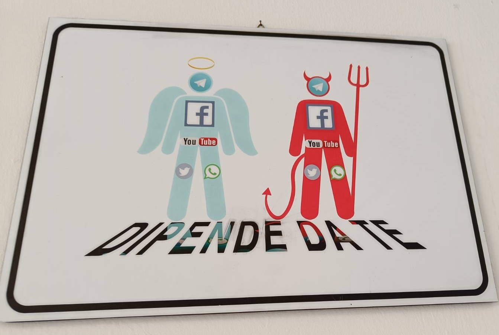
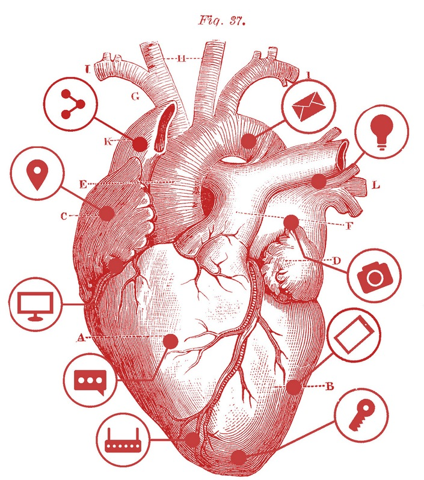
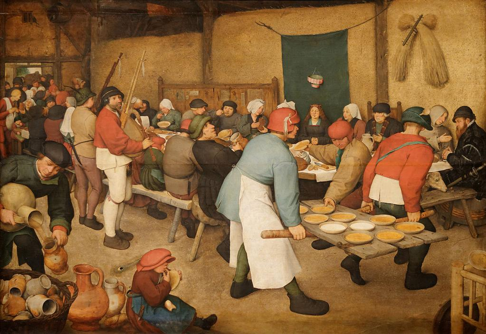

# Cooperate and Collaborate with Convivial Technologies

In the dynamic second session of the Creative Hacktivism Webinar, Agnese Trocchi led an exploration into hacking, digital design, and the concepts of affordance and nudging. Special guest Stella Nyanzi, a prominent Ugandan academic and activist, shared her experiences in digital activism and social media campaigns. The session featured a collaborative exercise emphasizing creative problem-solving, introducing practical digital tools for community organizing. The interactive Q&A with Stella delved into local events, sparking discussions on alternative digital tools and best practices for safeguarding campaigns on social media. This webinar left participants inspired and equipped to leverage creative hacktivism for positive social impact.

Find the Case Study to Stella Nyanzis forms of protest [here](/stella_nyanzi.md). 

geht weiter bei 54:50 min. riseup pad wird vorgestellt

## What is a Hacker and what does a Hacker do?

_Hacking is finding and building your own path, your own way to deal with digital worlds._

  

  <em>What is a Hacker?</em>

* **Unpeel layers:** Explore what lies beneath the smooth surface of technologies (try Ctrl-U on a webpage in your browser if you're using Windows or Linux, or Command-U on OSX).
* **Notice details:** Pay attention to details; for instance, details in a sender's email address can help you identify if it's a spam mail.
* **Use an oblique gaze:** Observe your behavior when you are in a relationship with the machine.
* **Share and collaborate:** Fostering the creation of new knowledge is essential; share what you notice or discover.

## Technologies of Domination

_We love using digital tools; each tool grants us unique abilities, but the way we use these powers is not always within our control._ 

  

  <em>Image seen in a secondary school in the north of Italy. Translation: It’s up to you</em>

### Is it really up to you? 

Zoom, Telegram, Facebook, YouTube, Tiktok… Each platform is designed in a certain way…

* Reproduces the culture of its creators.
* Embodies specific limitations and features inherent to the technical resource, known as [Affordance](https://en.wikipedia.org/wiki/Affordance).
* Exerts a subtle influence through conscious nudges.
* Shapes and impacts our thoughts and behaviors.

  

  <em>Book Cover: Agnese Trocchi ~ Internet Mon Amour</em>

**_"Technologies are tools, not data. They are ways of relating, realizations of worldviews, processes in the making. They depend heavily on interactions, that is: all technologies embody, incorporate and tend to evolve and take to the extreme the ideologies of the people who created them."_**  
From: [Agnese Trocchi ~ Internet Mon Amour](https://ima.circex.org/en/stories/6-conclusion/index.html)  
License: CC 4.0 (BY-NC-SA) 

## Convivial Technologies
### What is conviviality?

  

  <em>Pieter Bruegel the Younger, The Wedding Feast</em>

* Dynamic, plural and changeable 
* Neither chaos nor order, written in a rigid schedule 
* Not done in solitude 

### What is a Convivial Technology? 

* It's situated: assume and declare its position in the world.
* It tends to a fair and equal distribution of shares.
* It's FREE as Free Software: everyone can modify and improve; it belongs to the lineage of freedom.

## List of Tools / Software / Resources
### Friendly servers for email, blogs & other services:
* https://riseup.net/en  
    It's an instance of Etherpad Lite, a platform ensuring privacy as it operates outside Google's awareness. No login is required, and users can participate anonymously. Contributions are made at an equal level, and although deletions are possible, the data persists, mirroring the permanence of online content. Users can access the author versions' history by clicking on the clock icon with the anti-clockwise arrow.
* https://noblogs.org/

### Another social is possible 
* Mastodon (social) https://joinmastodon.org/ 
* Gancio (events) https://gancio.cisti.org/ 
* Blob (network) https://zecche.org/ 
* PeerTube https://joinpeertube.org/ 

### Organize and collaborate 
* Nextcloud https://nextcloud.com/sign-up/ 
* Pad: https://github.com/ether/etherpad-lite/wiki/Sites-That-Run-Etherpad
* Protectedtext - https://www.protectedtext.com 

### Learn more on security when using your mobile phone:
https://telefonisicuri.noblogs.org/files/2023/08/mobile-phone-security-1.pdf

### Communicate 
* Jitsi https://framatalk.org/abc/it/ 
* Jitsi: https://vc.autistici.org/

### Resources for everything 
* https://degooglisons-internet.org/en/

### Bibliography:
* Martino Morando, Padology  
  https://march.international/constant-padology/
* Agnese Trocchi, Internet, Mon Amour  
https://ima.circex.org/en
* Carlo Milani, Tecnologie Conviviali  
https://tc.eleuthera.it (Italian only)
* Critical Engineering Manifesto  
  https://criticalengineering.org
* "Nudge: Improving Decisions About Health, Wealth, and Happiness" by behavioral economist [Richard Thaler](https://en.wikipedia.org/wiki/Richard_Thaler) and legal scholar [Cass Sunstein](https://en.wikipedia.org/wiki/Cass_Sunstein)  
https://en.wikipedia.org/wiki/Nudge_(book)
