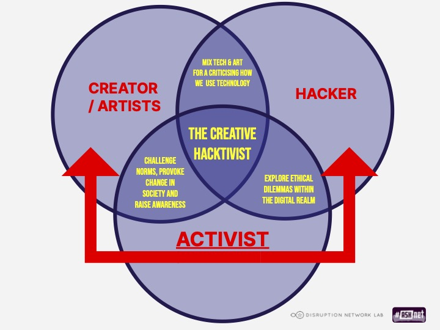
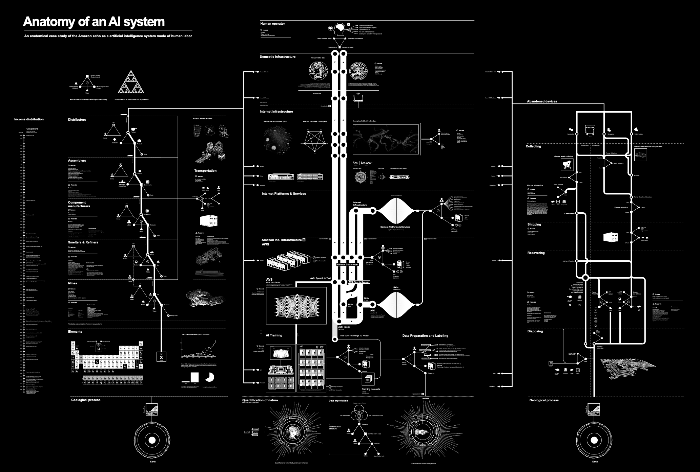
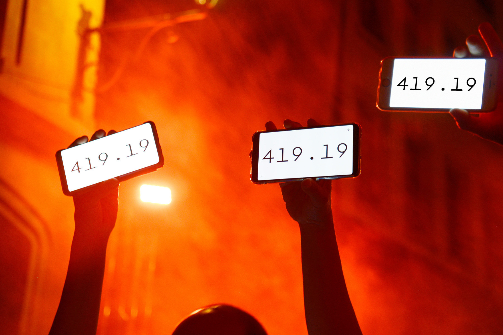

# Creative Hacktivism

## The Creative Hacktivist - composition of the term
<p align="center" width="100%">
  
</p>
<p align="center" width="100%">
  <em>The Creative Hacktivist - composition of the term</em></p>

The Creative Hacktivist combines technology and art to:
* Criticize the way technology is used by people.
* Criticize the way people are manipulated by technology.
* Explore the ethical dilemmas within the digital realm.  

The Creative Hacktivist merges the ethos of an artist and an activist to: 
* Challenge societal norms.
* Provoke change in society.
* Raise awareness.  

The concept of Creative Hacktivism finds its roots within the realm of internet activism. Leveraging electronic communication technologies, including various online and digital tools, it strives to facilitate swifter and more efficient communication among grassroots movements. This involves generating ideas pertaining to potential movements, defining their positions, and highlighting causes that deserve public attention and support.

##  Creative Hacktivism - examples of different projects 
The following paragraphs show diverse examples of Creative Hacktivism and its related topics. 

### The Critical Engineering Manifesto  

The Critical Engineering Manifesto is written by three people and includes 10 points and was written in 2011. It was inspired by the philosopher Bruno Latour

**»When a machine runs efficiently, when the technology responds to the need we have when we use it, one need focus only on its inputs and outputs and not on its internal complexity. Thus, paradoxically, the more science and technology succeed, the more opaque and obscure they become.«**
by Bruno Latour

Explanation with example of Bruno Latour's statement:  
In light of Bruno Latour's statement, let's consider the scenario where there is a desire to conduct an online meeting. To fulfill this need, one opts for a video conferencing tool (e.g., BigBlueButton, Zoom, Jitsi, etc.). While the tool satisfactorily meets this need and is user-friendly in its application, only a few individuals are capable of comprehending the technical intricacies operating in the background that make such an online conference possible. If we apply Latour's assertion, for instance, using a telephone (in the last century, not a smartphone) is comparable in terms of fulfilling the basic need of exchanging information over long distances through speech, but the technology behind it is considerably more accessible to understand. Latour perceives this condition – where technology and progress become increasingly user-friendly and accessible, yet simultaneously more complex and challenging to comprehend – as a potential threat.

<p align="center" width="100%">
  
</p>
<p align="center" width="100%">
  <em>The Critical Engineering Manifesto</em></p>

Two very important quotes from the Manifesto:
```
1. The Critical Engineer considers Engineering to be the most transformative language of our time,
shaping the way we move, communicate and think. It is the work of the Critical Engineer to study
and exploit this language, exposing its influence.
```
```
1. The Critical Engineer recognises that each work of engineering engineers its user,
proportional to that user's dependency upon it.
```
The manifesto defines today's engineering, especially in the digital realm, and elucidates the responsibilities of a Critical Engineer.
The manifesto can be found [here](https://criticalengineering.org/en).

### Internet and Privacy 
#### Hacking can be ethical
»The term Hacker has acquired a very negative sub meaning in the last decades, while it actually describes only a researcher, having a deep interaction with a computer in order to extract as much as possible from it.«
by Danja Vasilev

In his presentation from 2019, Danja Vasiliev discusses "dark internet topologies" in the context of a collaborative project called Vending Private Network with Julian Oliver. Instead of viewing the internet as a digital common or public space, Vasiliev uses network administrator tools to reveal a significant level of privatization. He suggests that we need new "dark abstractions" to create the kind of public space we envision on the internet. In essence, he demonstrates that "darknets" are technical counterparts to the rights and structures we cherish and protect in our physical public lives.

The presentation can be found [here](https://www.youtube.com/watch?v=C3DhUPT5k1Q).

#### Anatomy of an AI System
<p align="center" width="100%">
  
</p>
<p align="center" width="100%">
  <em>Anatomy of an AI System</em></p>

Kate Crawford and Vladan Joler describe the Amazon Echo as an anatomical map of human labor, data and planetary resources. 
They examine the extensive networks supporting the entire lifecycle of a single Amazon Echo smart speaker, summarizing this large amount of information into a detailed diagram, accompanied by an essay in 21 parts. Together, this becomes an anatomical map of a single AI system.

The map can be found [here](https://anatomyof.ai/).

### Climate Action
#### Per Million
<p align="center" width="100%">
  
</p>
<p align="center" width="100%">
  <em>Per million protest</em></p>

"Both protest tool and measurement reference, Per Million centers what may be the most important number of our time: the amount, in parts-per-million, of carbon dioxide in our planet’s atmosphere."

The project can be found [here](https://permillion.live/).

### Online and offline mobilisation 
#### XR - Extinction rebellion
<p align="center" width="100%">
  
</p>
<p align="center" width="100%">
  <em>Extinction Rebellion Symbol</em></p>


Image: Extinction Rebellion Symbol

Extinction Rebellion (abbreviated as XR) is a global environmental movement founded in the UK. Its stated goal is to use nonviolent civil disobedience to pressure governments into taking action to prevent tipping points in the climate system, biodiversity loss, and the risk of social and ecological collapse.

#### #MeToo Movement 

<p align="center" width="100%">
  
</p>
<p align="center" width="100%">
  <em>Alec Perkins from Hoboken, USA - Can You Hear Me Now? #MeToo</em></p>

The #MeToo movement is a social movement that began in 2017, originally on social media. It aims to raise awareness about the prevalence of sexual harassment and assault, particularly in the workplace. People, mainly women, shared their personal experiences using the hashtag #MeToo to show the widespread nature of such incidents. The movement seeks to empower survivors, hold perpetrators accountable, and foster a culture of respect and equality. It has had a significant impact on public discourse, advocacy, and policies related to sexual harassment and assault.