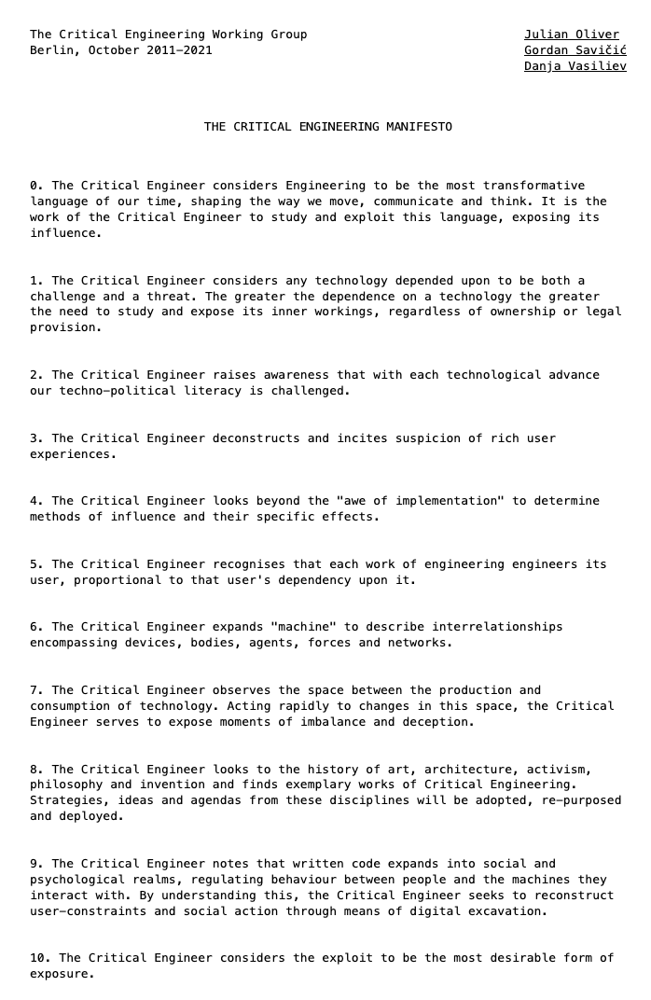

# Creative Hacktivism

## Introductory question:
When you think of an activist, who or what comes to mind? 

## The Creative Hacktivist - composition of the term


The Creative Hacktivist combines technology and art to:
* Criticize the way technology is used by people.
* Criticize the way people are manipulated by technology.
* Explore the ethical dilemmas within the digital realm.  

The Creative Hacktivist merges the ethos of an artist and an activist to: 
* Challenge societal norms.
* Provoke change in society.
* Raise awareness.  

The concept of Creative Hacktivism finds its roots within the realm of internet activism. Leveraging electronic communication technologies, including various online and digital tools, it strives to facilitate swifter and more efficient communication among grassroots movements. This involves generating ideas pertaining to potential movements, defining their positions, and highlighting causes that deserve public attention and support.

##  Creative Hacktivism - examples of different projects 

### The Critical Engineering Manifesto  

The Critical Engineering Manifesto is written by three people and includes 10 points and was written in 2011. It was inspired by the philosopher Bruno Latour

**»When a machine runs efficiently, when the technology responds to the need we have when we use it, one need focus only on its inputs and outputs and not on its internal complexity. Thus, paradoxically, the more science and technology succeed, the more opaque and obscure they become.«**
by Bruno Latour

Explanation with example of Bruno Latour's statement:  
In light of Bruno Latour's statement, let's consider the scenario where there is a desire to conduct an online meeting. To fulfill this need, one opts for a video conferencing tool (e.g., BigBlueButton, Zoom, Jitsi, etc.). While the tool satisfactorily meets this need and is user-friendly in its application, only a few individuals are capable of comprehending the technical intricacies operating in the background that make such an online conference possible. If we apply Latour's assertion, for instance, using a telephone (in the last century, not a smartphone) is comparable in terms of fulfilling the basic need of exchanging information over long distances through speech, but the technology behind it is considerably more accessible to understand. Latour perceives this condition – where technology and progress become increasingly user-friendly and accessible, yet simultaneously more complex and challenging to comprehend – as a potential threat.


<p align="center" width="100%">
  
</p>


Two very important quotes from the Manifesto:
```
0. The Critical Engineer considers Engineering to be the most transformative language of our time,
shaping the way we move, communicate and think. It is the work of the Critical Engineer to study
and exploit this language, exposing its influence.
```
```
5. The Critical Engineer recognises that each work of engineering engineers its user,
proportional to that user's dependency upon it.
```
The manifesto defines today's engineering, especially in the digital realm, and elucidates the responsibilities of a Critical Engineer.
The manifesto can be found [here](https://criticalengineering.org/en).
