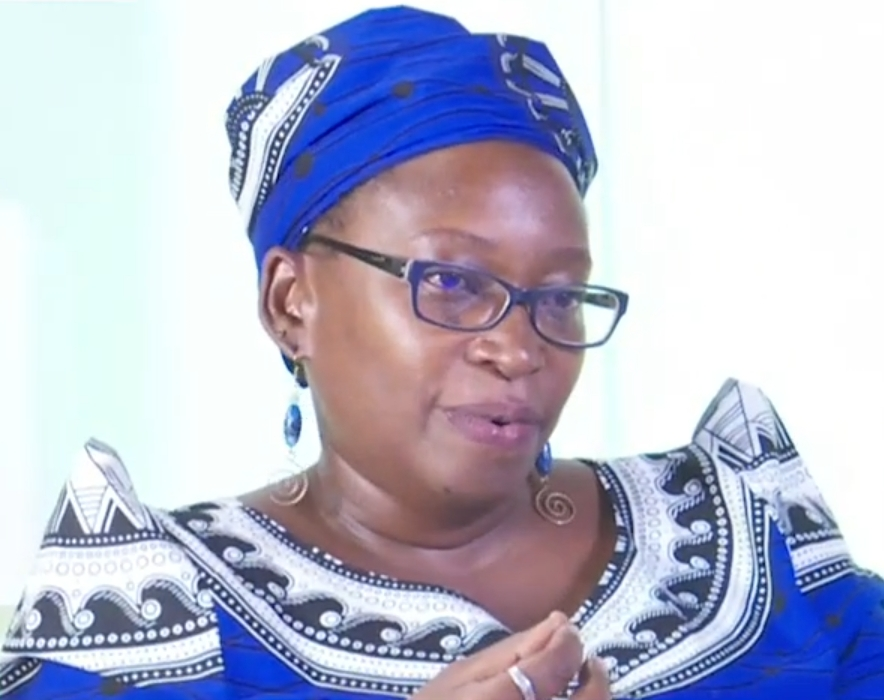

## Case Study Stella Nyanzi:

  

  <em>Stella Nyanzi, September 2020</em>

Stella Nyanzi, an Ugandan academic, activist, artist, and agitator, currently resides in Germany and holds a scholarship in the Writers-in-Exile program at PEN Zentrum Deutschland. With a Ph.D. in medical anthropology, her research focuses on family planning, sexual sub-cultures, masculinities, and queer African studies. She identifies as a radical queer African feminist scholar and activist.

Known for passionate protests targeting individuals with power, such as the police in Uganda, Stella turned to digital activism during the COVID-19 pandemic. Alongside her children, she protested food shortages from their room and organized a social media-driven protest in front of a court. Her arrest as the movement's leader was documented and shared online.

Utilizing hashtags, Nyanzi mobilizes support for various causes, gaining international attention for posts on the women's march in Uganda and staging impactful protests, like sharing nudes in front of her office after being denied entry. Her bold actions brought much-needed recognition from the press.

In addition to her diverse campaigns, Stella Nyanzi has faced legal challenges, being convicted twice under the Computer Misuse Act.

Stellas presentation was followed by a Questions and Answer session. 

Find the video with Stella Nyanzi [here](https://www.youtube.com/watch?v=0xc6OA6SJAE&t=2s).
(Start: 6:07 min.)